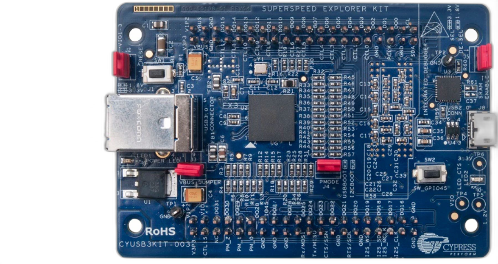

# Cypress FX3 Project Template with CMake Build System

A template project for Cypress FX3 USB firmware development featuring modern CMake build system and VSCode integration.  
The example firmware demonstrates basic GPIO usage with LED blinking and UART output on button press.

## Prerequisites

### Hardware



[CYUSB3KIT-003 EZ-USB™ FX3 SuperSpeed explorer kit](https://www.infineon.com/cms/en/product/evaluation-boards/cyusb3kit-003/)

### Software

- Cypress FX3 SDK (1.3.5)
  - ARM GCC Toolchain (4.8.1)
- CMake (3.22 or higher)
- Visual Studio Code (optional)

## Environment Setup

1. Download and Install Cypress FX3 SDK from Cypress  
2. Check the following environment variables:
   - `FX3_INSTALL_PATH`: Path to FX3 SDK installation
   - `ARMGCC_INSTALL_PATH`: Path to ARM GCC toolchain
   - `ARMGCC_VERSION`: GCC version (e.g., "4.8.1")

## Project Structure

```md
  CypressFX3Template/
  ├── .vscode/              # VSCode configuration
  │   └── tasks.json       # Build and flash tasks
  ├── cmake/               # CMake configuration files
  │   ├── fx3-sdk.cmake   # SDK paths and checks
  │   └── fx3-toolchain.cmake  # Toolchain configuration
  ├── src/                 # Source files
  │   └── main.c          # Example firmware
  ├── CMakeLists.txt      # Main CMake configuration
  ├── CMakePresets.json   # CMake presets configuration
  └── README.md
```

## Building the Firmware

### Using CMake Directly via CLI

#### CMake Configure

```bash
cmake --preset <Config>
```

#### CMake Build

```bash
cmake --build --preset <Config>
```

Preset options:  

- Debug
- RelWithDebInfo
- Release
- MinSizeRel

## Flashing the firmware

Using VSCode Tasks

Press Ctrl+Alt+T or open "Select Task to run"
Choose task:

- Build FX3 Firmware: Build only  
- Flash FX3 Firmware: Flash only  
- Build and Flash FX3 Firmware: Build and flash  
- Flash FX3 Bootloader: Flash bootloader  
- Select build type (Debug/Release)

## Example Firmware Features

The template includes a basic example that demonstrates:

LED2 blinking using GPIO  
Button input detection  
UART debug output  
Basic FX3 initialization  

Hardware Connections

- LED2: GPIO 54  
- Button: GPIO 45  
- UART conntected to On-board USB to Serial Chip CY7C65215:

## Contributing

Feel free to submit issues and pull requests.
